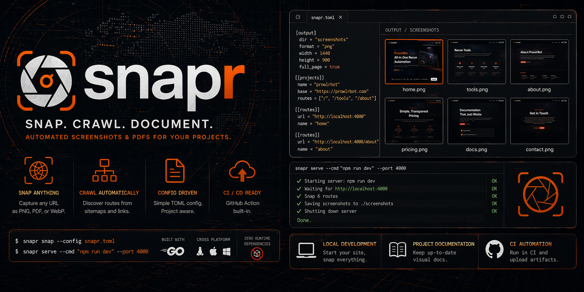

<p align="center">
  
</p>

<p align="center">
  <a href="https://github.com/kdairatchi/snapr/releases"></a>
  <a href="https://github.com/kdairatchi/snapr/actions"></a>
  <a href="LICENSE"></a>
  
</p>

---

**snapr** captures full-page screenshots and PDFs of any web project — local dev server, deployed site, or CI pipeline. Single Go binary, no runtime dependencies, TOML config, GitHub Action included.

## Install

**Go:**
```bash
go install github.com/kdairatchi/snapr@latest
```

**Homebrew:**
```bash
brew install kdairatchi/tap/snapr
```

**Binary (Linux / macOS / Windows):**

Download from [Releases](https://github.com/kdairatchi/snapr/releases), extract, add to `$PATH`.

> Requires Chrome or Chromium to be installed.

---

## Commands

### `snap` — capture from a URL or config

```bash
# single URL
snapr snap http://localhost:4000

# all routes in snapr.toml
snapr snap --config snapr.toml

# full-page PDF
snapr snap http://localhost:4000 --format pdf --full

# multiple viewports
snapr snap --config snapr.toml --viewports mobile,desktop

# parallel workers
snapr snap --config snapr.toml --workers 8
```

### `crawl` — auto-discover routes then capture them all

```bash
# follow links from a base URL
snapr crawl http://localhost:4000

# use sitemap.xml if available, fall back to crawl
snapr crawl https://mysite.com --sitemap

# cap at N pages
snapr crawl http://localhost:3000 --max 20 --workers 6
```

### `serve` — start a dev server, snap it, shut it down

```bash
# hwaro / SSG
snapr serve --cmd "hwaro serve" --port 4000

# Next.js / Vite / Hugo
snapr serve --cmd "npm run dev" --port 3000 --config snapr.toml
snapr serve --cmd "hugo server"  --port 1313 --wait 10
```

### `diff` — pixel diff between two screenshot sets

```bash
# compare baseline vs current
snapr diff screenshots/baseline screenshots/current

# fail CI if anything changed
snapr diff screenshots/baseline screenshots/current --fail-on-diff

# stricter threshold, ignore tiny changes
snapr diff screenshots/baseline screenshots/current \
  --threshold 0.05 --min-percent 0.5
```

### `report` — generate a self-contained HTML gallery

```bash
# embedded images (default) — single portable file
snapr report --title "Deploy preview"

# linked images
snapr report --embed=false --out docs/screenshots.html
```

---

## Config — `snapr.toml`

```toml
[output]
dir      = "screenshots"
format   = "png"       # png | pdf | webp
width    = 1440
height   = 900
full_page = true

# individual routes
[[routes]]
url  = "http://localhost:4000"
name = "home"

[[routes]]
url  = "http://localhost:4000/about"
name = "about"

# project shorthand — base URL + path list
[[projects]]
name   = "prowlrbot"
base   = "https://prowlrbot.com"
routes = ["/", "/tools", "/about", "/blog"]
```

Copy the example:
```bash
cp snapr.toml.example snapr.toml
```

---

## GitHub Action

Drop-in action that installs snapr, captures screenshots, and uploads them as a workflow artifact.

```yaml
- name: Screenshot
  uses: kdairatchi/snapr@v1
  with:
    config: snapr.toml
    upload: true
```

**All inputs:**

| Input | Default | Description |
|---|---|---|
| `config` | `snapr.toml` | Path to config file |
| `url` | — | Single URL (alternative to config) |
| `format` | `png` | `png`, `pdf`, or `webp` |
| `out` | `screenshots` | Output directory |
| `full` | `true` | Full-page capture |
| `upload` | `true` | Upload as workflow artifact |
| `version` | `latest` | snapr version to install |

**Visual regression workflow:**

```yaml
jobs:
  screenshot-test:
    runs-on: ubuntu-latest
    steps:
      - uses: actions/checkout@v4

      - name: Capture current
        uses: kdairatchi/snapr@v1
        with:
          config: snapr.toml
          out: screenshots/current

      - name: Diff against baseline
        run: snapr diff screenshots/baseline screenshots/current --fail-on-diff
```

---

## Viewports

Capture the same routes at multiple screen sizes in one run:

```bash
snapr snap --config snapr.toml --viewports mobile,tablet,desktop
```

| Name | Width | Height |
|---|---|---|
| `mobile` | 375 | 812 |
| `tablet` | 768 | 1024 |
| `desktop` | 1440 | 900 |
| `wide` | 1920 | 1080 |

Output files are named `<route>-<viewport>.png` — e.g. `home-mobile.png`, `home-desktop.png`.

---

## Output

Every `snap` and `crawl` run writes a `manifest.json` alongside the screenshots:

```json
{
  "generated": "2026-04-22T19:00:00Z",
  "count": 4,
  "routes": [
    { "url": "http://localhost:4000", "name": "home", "file": "home.png", "path": "screenshots/home.png", "error": null }
  ]
}
```

The `report` command reads this manifest to build the HTML gallery with URL metadata per screenshot.

---

## Use cases

**Local development** — preview your SSG or framework before pushing.

```bash
snapr serve --cmd "hugo server" --port 1313
```

**Project documentation** — auto-generate a visual index of every page.

```bash
snapr crawl https://yoursite.com --sitemap
snapr report --title "Site map"
```

**CI automation** — catch visual regressions before they ship.

```yaml
- uses: kdairatchi/snapr@v1
  with: { config: snapr.toml, upload: true }
```

---

## Comparison

| | snapr | gowitness |
|---|---|---|
| Primary use | Developer / CI | Pentest recon |
| Config file | TOML — named routes + projects | None |
| Dev server lifecycle | `serve` command | No |
| Visual diff / regression | `diff` command | No |
| HTML gallery | `report` command | Web UI (SQLite-backed) |
| Multi-viewport | `--viewports` flag | No |
| Input methods | URL, config, sitemap, crawl | URL, file, CIDR, nmap/nessus XML |
| Distribution | Single binary, Homebrew | Single binary |

---

## Contributing

```bash
git clone https://github.com/kdairatchi/snapr
cd snapr
go build ./...
go vet ./...
```

Requires Go 1.22+ and Chrome/Chromium.

---

<p align="center">built by <a href="https://github.com/kdairatchi">kdairatchi</a></p>
